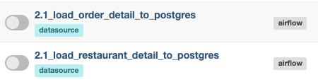
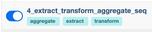

# Airflow ELT PostgresDB to Hadoop

## Get start

locally run docker compose with
```bash
make build-start
```

So, we have Airflow on `http://localhost:8080`

Firstly, suppose that we have PostgresDB as a datasouce for data ingestion ,we have to generate datasource by triggering prepared datasource generator dags



Now, we have tables in PostgresDB
(order_detail, restaurant_detail)

Lastly, suppose that we have ETL for daily batch ingestion, we can test triggering a ETL dag



the aggregated result is in folder `/sql_requirement`
(discount.csv, cooking.csv)
